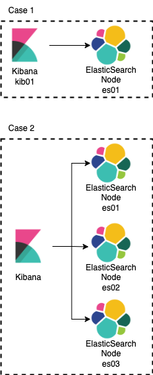

# Elastic Search para Arquitetura Retrieval Augmented Generation

- [Elastic Search para Arquitetura Retrieval Augmented Generation](#elastic-search-para-arquitetura-retrieval-augmented-generation)
  - [Arquitetura](#arquitetura)
  - [Introdução](#introdução)
  - [O que é Retrieval Augmented Generation?](#o-que-é-retrieval-augmented-generation)
  - [Como o Elastic Search pode ser usado na RAG?](#como-o-elastic-search-pode-ser-usado-na-rag)
  - [Benefícios de usar o Elastic Search na RAG](#benefícios-de-usar-o-elastic-search-na-rag)
    - [Escalabilidade](#escalabilidade)
    - [Desempenho](#desempenho)
  - [Como rodar o Elastic Search localmente](#como-rodar-o-elastic-search-localmente)
    - [Execute o seguintes comandos](#execute-o-seguintes-comandos)
      - [Para iniciar a aplicação](#para-iniciar-a-aplicação)
      - [Crie um token te acesso](#crie-um-token-te-acesso)
      - [Gere o código de verificação](#gere-o-código-de-verificação)
      - [Login no Kibana](#login-no-kibana)

## Arquitetura

No repositório são disponibilizados dois tipos de Deploys

ElasticSearch com kibana + um nó

ElasticSearch com kibana + três nós (Dispensa uma parte da configuração)

## Introdução

O Elastic Search é um motor de busca e análise distribuído, de código aberto, que permite armazenar, buscar e analisar grandes volumes de dados de forma rápida e eficiente. É uma ferramenta poderosa que pode ser utilizada em diversos casos de uso, incluindo a Arquitetura Retrieval Augmented Generation (RAG).

## O que é Retrieval Augmented Generation?
A RAG é uma arquitetura de modelo de linguagem que combina a recuperação de informações com a geração de texto. Na RAG, um modelo de recuperação de informações é usado para identificar documentos relevantes para uma consulta, e um modelo de geração de texto é usado para gerar texto novo a partir desses documentos.

## Como o Elastic Search pode ser usado na RAG?
O Elastic Search pode ser usado como o componente de recuperação de informações na RAG. Ele pode ser usado para indexar documentos relevantes para a consulta e para retornar esses documentos em uma ordem ranqueada.

## Benefícios de usar o Elastic Search na RAG

### Escalabilidade
 O Elastic Search é altamente escalável e pode ser usado para indexar e buscar grandes volumes de dados.

### Desempenho
O Elastic Search é muito rápido e pode realizar pesquisas em tempo real.
Relevância: O Elastic Search usa técnicas avançadas de ranqueamento para retornar os documentos mais relevantes para a consulta.

## Como rodar o Elastic Search localmente

Para rodar o Elastic Search localmente, siga as etapas abaixo

- [Instale o Docker](https://www.docker.com/products/docker-desktop/)
- Navegue até o diretório do repositório desejado

### Execute o seguintes comandos

#### Para iniciar a aplicação
`docker-compose up -d`

Após alguns segundos abra o navegador na página http://localhost:5601

Para conectar ao host do ElasticSearch realize os seguintes passos

#### Crie um token te acesso
Para acessar o Kibana, você precisará de um token de acesso.

Você pode gerar um token de acesso com o seguinte comando

`docker exec -it es01 /usr/share/elasticsearch/bin/elasticsearch-create-enrollment-token -s kibana`

Obtenha o token de acesso e copie no kibana, após isso será solicitado um token de verificação de 6 dígitos.

#### Gere o código de verificação

Após gerar o token de acesso, você precisará obter um código de verificação. Você pode obter o código de verificação com o seguinte comando:

`docker exec -it kib01 bin/kibana-verification-code`

#### Login no Kibana

Para realizar login no Kibana, use as seguintes credenciais

`Usuário: elastic`

`Senha: elastic123`

[Documentação do Elastic Search](https://www.elastic.co/guide/)
[Documentação do Kibana](https://www.elastic.co/guide/en/kibana/current/)